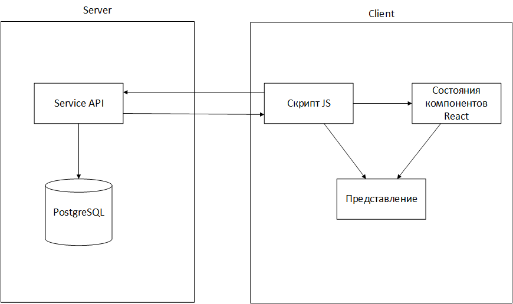
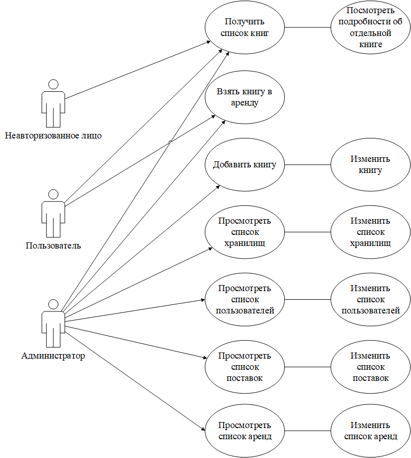

# App description
Module “Home”
- Find books using the search bar
- View book information
- Go to pages with information about the library and contacts

Login module
- Enter your password and login
- Gain access to some features, depending on your role
- Log out of your account

About Library module
- View information about the library
- Go to other available pages

Readers module
- View information for readers
- Go to other available pages

Contacts module
- View contacts of responsible persons
- Go to other available pages

Book module
- View information about the book
- Depending on the access opens the possibility to book, delete, change information about the book.

Administrator module
- Add, edit and delete a storage
- Add, edit and delete rentals
- Add, edit and delete users
- Add, edit and delete books
- Add, edit and delete book arrivals information

There are two types of users in the application:
- Regular users
    - View book data
    - View library data
    - Search for books with filtering
    - Authorization
    - Make reservations
- Administrator
    - Adds / Edits / Deletes book data
    - Adds / Edits / Deletes user data
    - Adds / Edits / Deletes storage data
    - Adds / Edits / Deletes rental data
    - Adds / Edits / Deletes book supply and disposal data

# Architecture

# Use-case diagram

# Database structure
The “Stores” table consists of the following fields
- Identifier
- Address

The “Users” table consists of the following fields
- Identifier
- Role
- Full name
- Date of Birth
- Phone number
- E-mail
- Library card number

The table “History of storage receipts” consists of the following fields
- Identifier
- Book Identifier
- Change
- Date
- Vault identifier

The Book Storage Location table consists of the following fields
- Book identifier
- Storage identifier
- Quantity

Table “Book” consists of the following fields
- Identifier
- ISBN
- LBC
- Title
- Authors
- Type of edition
- Additional information
- Language

The table “Rent” consists of the following fields
- Identifier
- User ID
- Book identifier
- Lease start date
- Lease end date